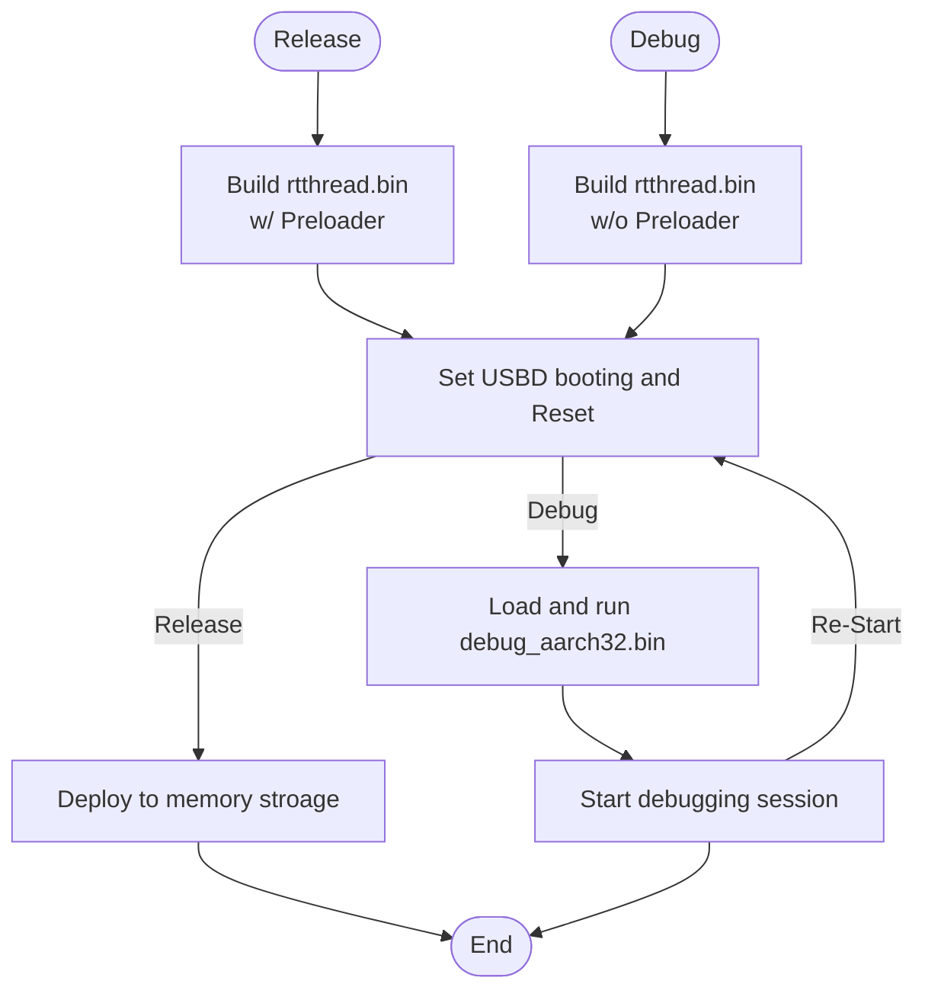
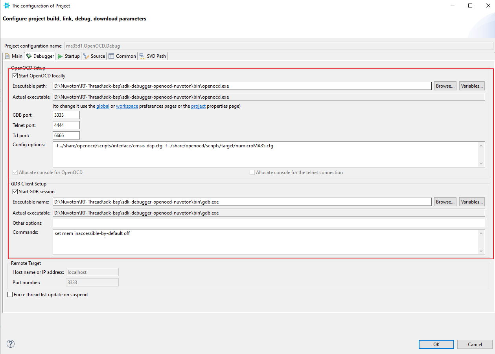
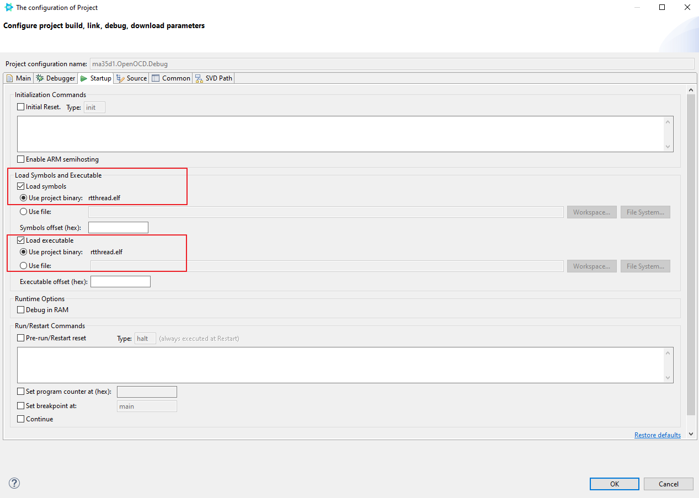

# **How to use Nu-Link2 debugger on RT-Thread Studio**

In this document, we will explain how to debug MA35D1 series application code using the Nuvoton Nu-Link2 debugger in conjunction with OpenOCD and GDB within rt-thread studio.

# **Development process**

The development process is divided into two phases: Release and Debug, which use different "rtthread.bin" files. In the Release process, we integrate the Preloader into the rtthread.bin to serve as the boot loader and execute "nuwriter_program*.bat" scripts to deploy rtthread.bin to various memory storage. While in the Debug process, we do not merge the Preloader into rtthread.bin. When a user needs to debug the program, they should switch the boot mode to the USBD booting mode and reset the board. After resetting, user can run the "nuwriter_debug_aarch32.bat" program to perform basic initialization of the dual-CA35 cores and keep them in the AARCH32 execution state, waiting for the On-Chip debugger and GDB to take over for further processing.



# **Requirement**

## Hardware

- Nuvoton [Nu-Link2-Pro](https://www.nuvoton.com/tool-and-software/debugger-and-programmer/1-to-1-debugger-and-programmer/nu-link2-pro/) debugger or Nu-Link2-Me daughter board.
- Nuvoton MA35D1 development board with USBD port.

## Software

- [RT-Thread Studio](https://www.rt-thread.org/studio.html) (>v2.2.6)
- [gdb-multiarch-13.2](https://static.grumpycoder.net/pixel/gdb-multiarch-windows/gdb-multiarch-13.2.zip)
- [OpenOCD-20231002-0.12.0](https://sysprogs.com/getfile/2124/openocd-20231002.7z)

# **Start a debugging session on RT-Thread Studio**

## Step 1: Cancel Preloader linking

- Open <project>/linking_scripts/aarch32.ld file.
- Comment the **KEEP(*(.text.entrypoint))** line to cancel Preloader linking as below:

```c
    ...
    .text :
    {
        /* KEEP(*(.text.entrypoint)) */       /* The entry point */
        *(.vectors)
    ....
```

- Rebuild project.

## Step 2:  RT-Thread Studio Debugger Configuration

To modify debugger configuration of project as below:

- Debugger tab
  - OpenOCD Setup
    - Start OpenOCD locally: Enable
    - Specify OpenOCD program path for your environment .
    - GDB port: 3333
    - Telnet port: 4444
    - Tcl port: 6666
    - Config option

        ```bash
        -f ../share/openocd/scripts/interface/cmsis-dap.cfg -f ../share/openocd/scripts/target/numicroMA35.cfg
        ```

  - GDB Client Setup
    - Start OpenOCD locally: Enable
    - Specify OpenOCD program path for your environment .
    - Commands

        ```bash
        set mem inaccessible-by-default off
        ```

<p align="center">

</p>

- Startup tab
  - Load Symbols and Executable
    - Load symbols: Enable
      - Use Project binary: Enable
    - Load Executable
      - Use project binary: Enable

<p align="center">

</p>

## Step 3: Set power-on setting to USBD, then reset board

## Step 4: Execute nuwriter_debug_aarch32.bat

## Step 5: Start RT-Thread Studio debugging

# **Demo**

<p align="center">

</p>
