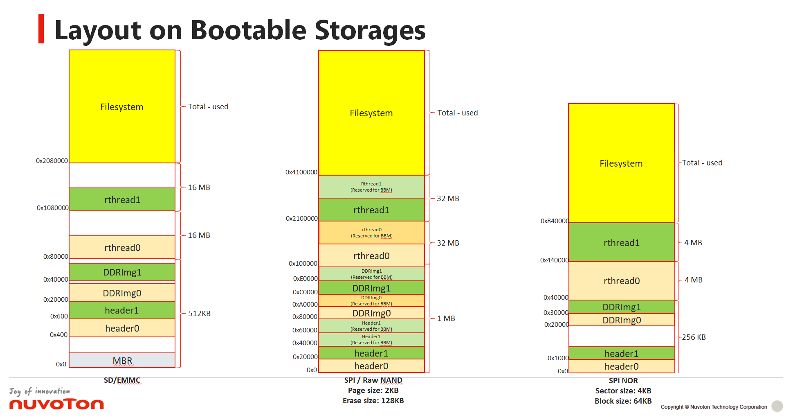
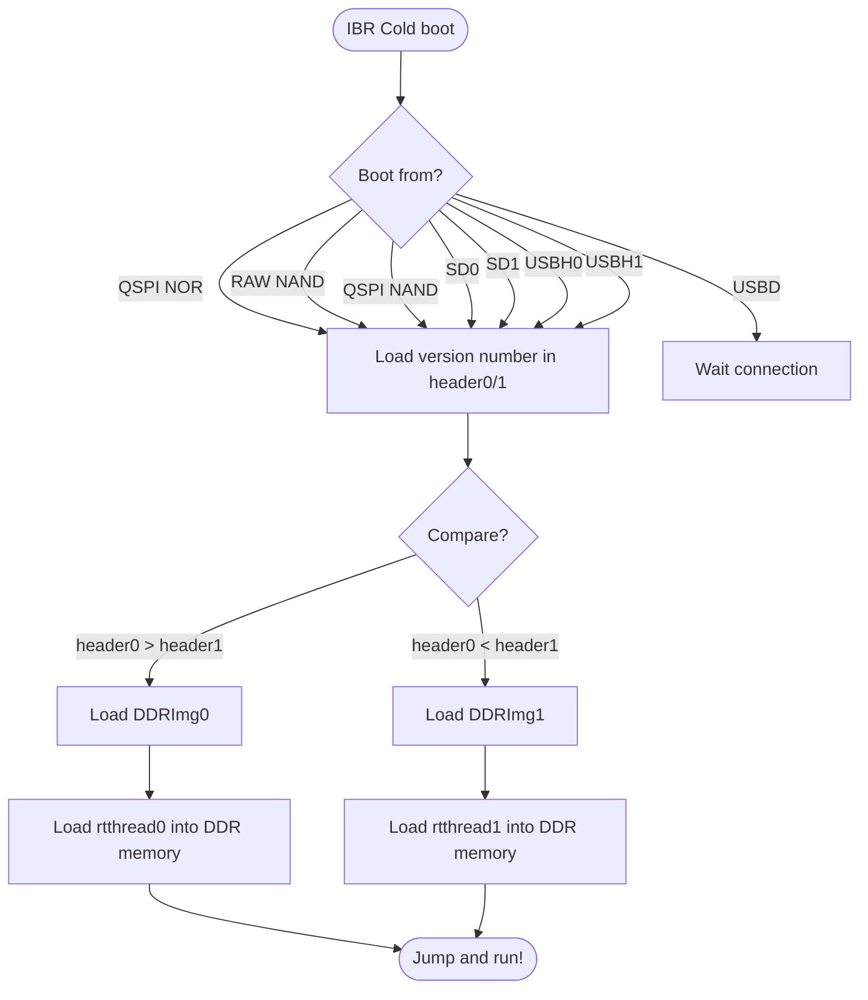
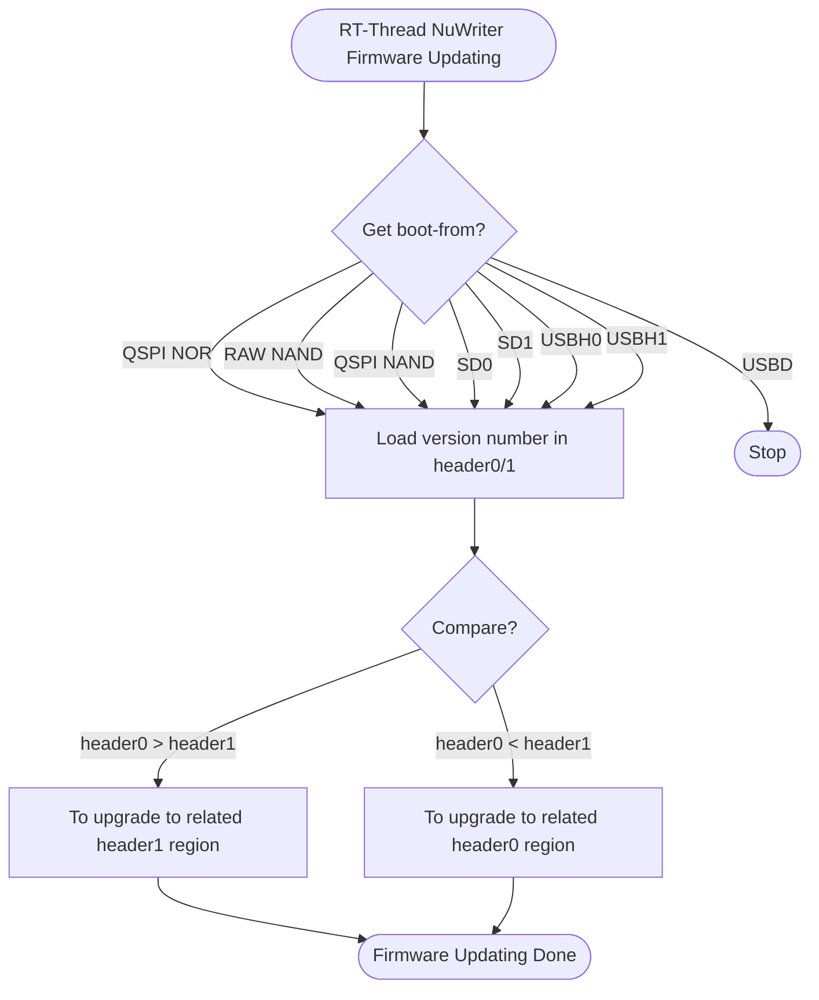
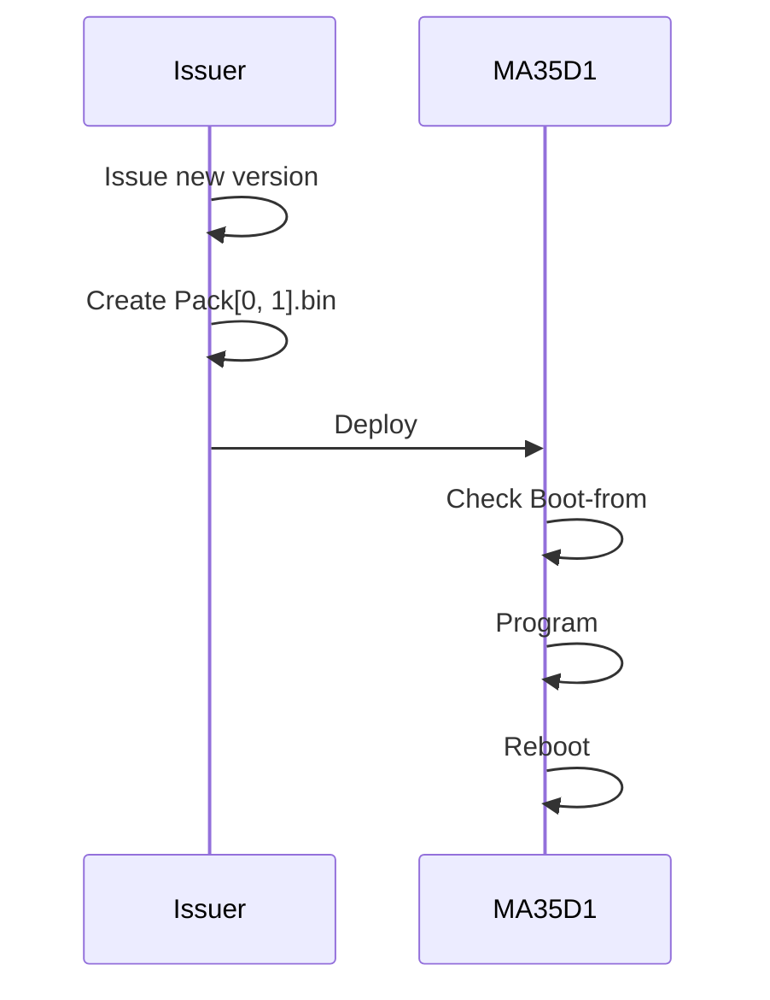

# **In-system Firmware Updating**

- Provide firmware updating way in rt-thread system.
- An in-system programming utility for rt-thread called nuwriter available for firmware updating.
- IBR compares version number of both header0 and header1 and load bigger version number firmware to run.

<p align="center">

</p>

## **Important**

- These version numbers of both header0 and header1 should be assigned different and newer version is bigger number.
- The headerX.bin image must be placed at first in packX.bin file.
- SPI/RAW NAND flash need reserve **Enough Valid Blocks** for skipping bad-block mechanism.
- Dual-headers must be placed in various storage device as below:

|Boot Storage|header0 offset|header1 offset|Note|
|-|-|-|-|
|SD|Sector 2, 0x400|Sector 3, 0x600|<ul><li>Sector size is 512B</li><li>Sector 0 is MBR</li></ul>|
|eMMC|Sector 2, 0x400|Sector 3, 0x600|<ul><li>Sector size is 512B</li><li>Sector 0 is MBR</li></ul>|
|Raw NAND|Block 0, 0x0|Block 1, 0x20000|<ul><li>Block size = PSxPPB</li><li>Image start address must be block-alignment.</li></ul> |
|SPI NAND|Block 0, 0x0|Block 1, 0x20000|<ul><li>Block size = PSxPPB</li><li>Image offset address must be block-alignment.</li><li>The page of block(PPB) SPI NAND flash must be 64, 128 or 256.</li></ul> |
|SPINOR|Sector 0, 0x0|Sector 1, 0x1000|<ul><li>Block size = 64KB</li><li>Sector size = 4KB</li><li>SPI NOR flash need supports 4KB-sector erase size.</li></ul> |

## **RT-Thread NuWriter**

```bash
msh />nuwriter
usage: nuwriter [option] [target] ...

usage options:
  -h,              --help          Print defined help message.
  -f URI,          --file=URI      Specify NuWriter Pack file.(local).
  -d Device name,  --device=device Specify device name.
  -p,              --program       Execute program.
  -r,              --readback      Read back from storage.

For examples,
  Pack file verification:
    nuwriter -f /mnt/udisk/pack.bin
  Pack file programming to SD/QSPINAND/RAWNAND/QSPINOR storage:
    nuwriter -f /mnt/udisk/pack.bin -d sd1 --program
    nuwriter -f /mnt/udisk/pack.bin -d nand2 --program
    nuwriter -f /mnt/udisk/pack.bin -d rawnd2 --program
    nuwriter -f /mnt/udisk/pack.bin -d sf_whole --program
  Read back content of specified MTD device to specified file:
    nuwriter -f /nand0.bin -d nand0 --readback
```

## IBR Cold-boot Flow



## **RT-Thread NuWriter Firmware-updating Flow**



## **Basic Firmware-updating Operation**


